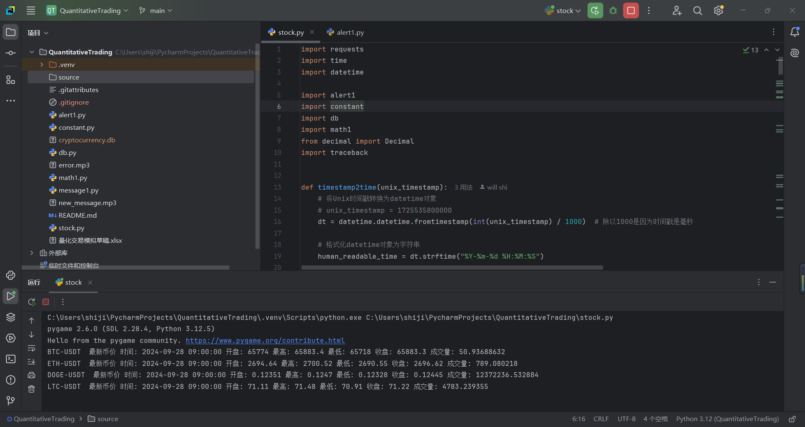
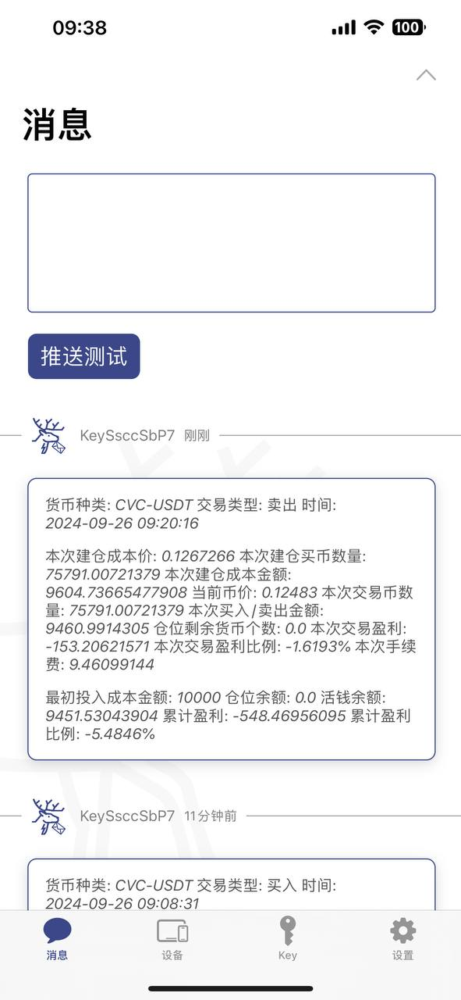
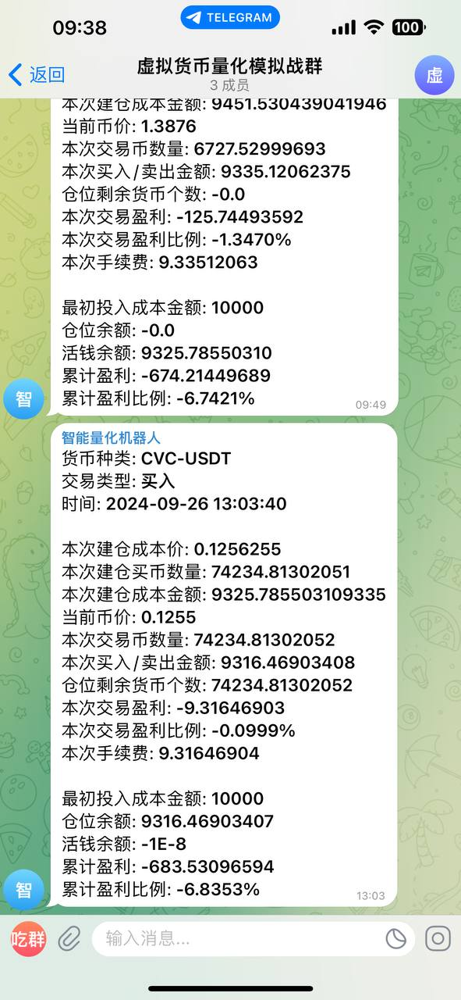

交流群:https://t.me/usdt11113

```markdown
# 环境配置
- **Python版本**：3.12.5

# 依赖安装
```bash
pip install requests
pip install pygame
```

# 密钥申请
程序远程提醒需要申请下面两个密钥，申请方式请自行搜索
- Push Deer
- Telegram Bot

# 程序框架说明
程序可以基于已设定的业务逻辑，进行虚拟货币价格的监控、买入卖出计算、盈亏分析。提供多种途径的在家+远程提醒功能，并涵盖健康呵护等功能。它是免费的、可靠的散户全自动量化交易解决方案。

# 程序业务逻辑
业务分为四个部分：
1. **MA上交买入**
2. **MA下交卖出**
3. **指定涨幅卖出**
4. **诱多陷阱逃离**

# 免责声明
本程序完全基于个人已有的炒股经验及数学统计学理论指导。请务必替换成你自己的业务实现，本程序仅作学习交流，不构成投资建议。切勿盲目跟单，若造成资金损失，须自行承担。

# 运行
使用 PyCharm，进入 `stock.py` 文件，右键运行即可。

# 运行效果展示



